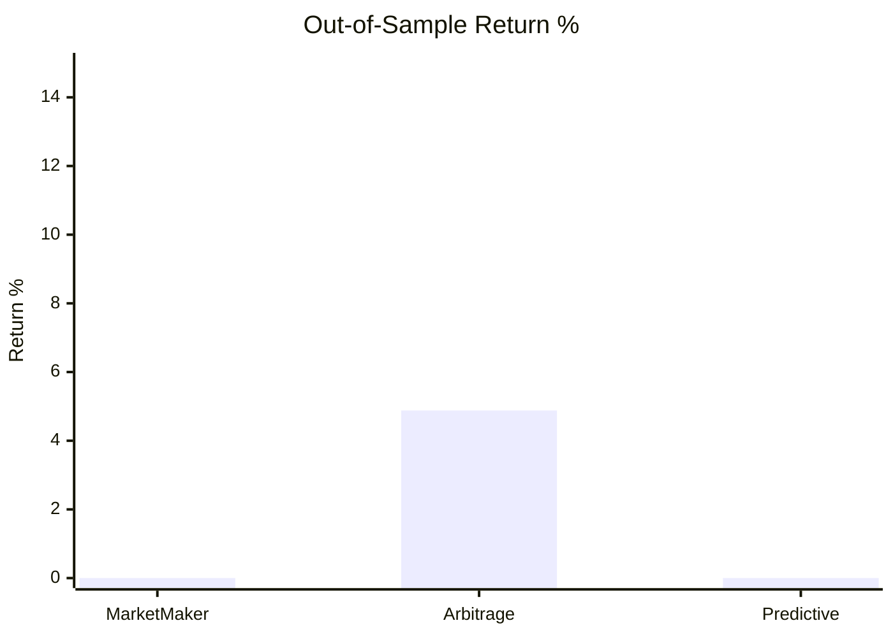
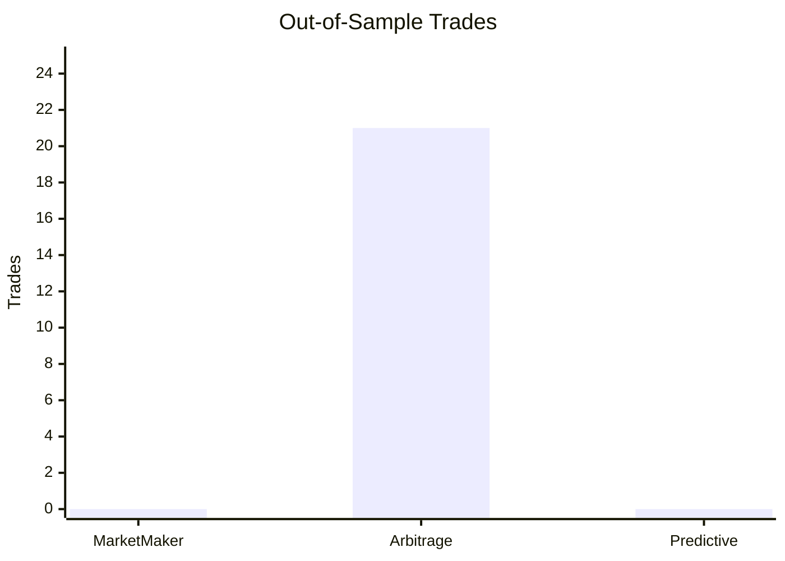
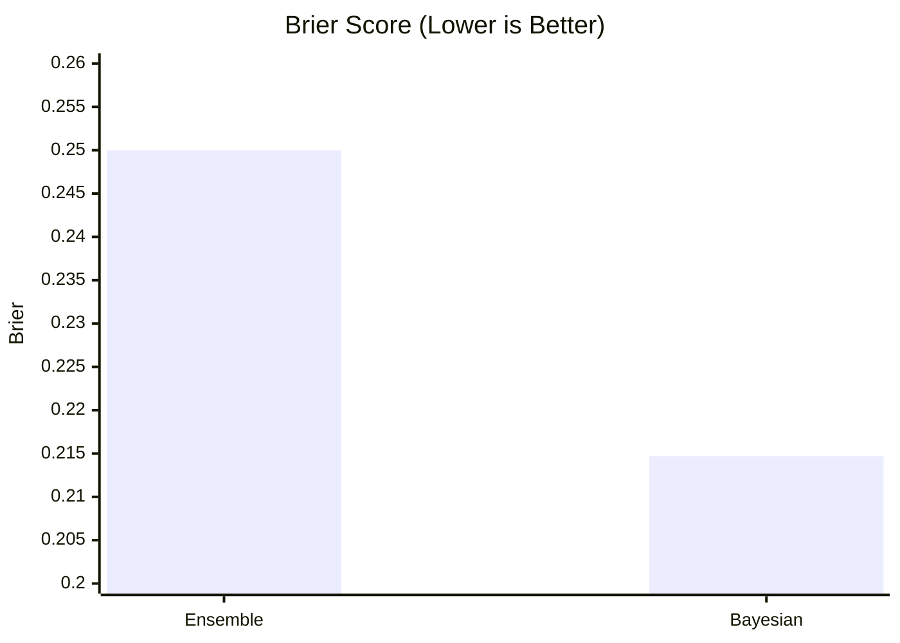

# Project Report

## 1. Executive Summary

This project delivers a complete prediction market research and trading platform.

Required scope was to build an end-to-end system for live data ingestion, strategy development, backtesting, forward testing, calibration analysis, dashboard delivery, reproducible outputs, and Dockerized execution.

Current runtime uses live Polymarket APIs and satisfies the full scope.

## 2. Requirement Coverage

| Requirement | Implementation | Status |
|---|---|---|
| Live market data ingestion | Polymarket Gamma, CLOB, and Data API integration | Complete |
| Backtesting engine | Event-driven bar-by-bar simulation with costs and settlement | Complete |
| Strategy set | Market Maker, Arbitrage, Predictive (LR + GBT) | Complete |
| Forward testing | Rolling walk-forward and paper trading | Complete |
| Calibration and risk analysis | Brier, ECE, decomposition, risk controls | Complete |
| Frontend delivery | Streamlit multipage dashboard | Complete |
| Reproducible outputs | Automated generation to results folder | Complete |
| Test coverage | Automated tests for core modules | Complete |
| Docker runtime | Web + jobs services with startup checks | Complete |

## 3. What Was Built

### Data Layer

- Live market fetcher for Polymarket endpoints
- Unified runtime loader for frontend and batch workflows
- Standardized market schema for engine and strategies

### Strategy and Modeling Layer

- Market Maker strategy for spread capture with inventory control
- Arbitrage strategy for imbalance and fair-value dislocations
- Predictive strategy using Logistic Regression + Gradient Boosted Trees
- Calibration and Bayesian comparison modules

### Execution Layer

- Event-driven backtesting engine
- Forward testing components (rolling simulation + paper trader)
- Trade logging and performance metrics

### Product Layer

- Streamlit dashboard with five operational pages
- Docker image and compose orchestration for web and jobs

## 4. Current Runtime State

- Data source: live Polymarket APIs
- Runtime entrypoints:
	- Dashboard: frontend/app.py
	- Batch results: generate_results.py
- Synthetic market code is not part of runtime flow
- Primary outputs are generated under results/

## 5. Latest Results Snapshot

### Out-of-Sample Return



### Out-of-Sample Trades



### Calibration (Brier)



### Key Numbers

| Metric | Value |
|---|---:|
| Markets in dataset | 78 |
| Market observations | 180,194 |
| Best OOS return | +4.88% (Arbitrage) |
| Best OOS profit factor | 1.42 (Arbitrage) |
| Ensemble Brier | 0.2500 |
| Bayesian Brier | 0.2147 |

## 6. Validation

Validation executed for this implementation:

- automated tests passing
- live API smoke checks (REST and websocket protocol path)
- dashboard route checks
- Docker image build and service execution checks

## 7. Runbook

### Local

```bash
pip install -r requirements.txt
streamlit run frontend/app.py
python generate_results.py
pytest tests -v
```

### Docker

```bash
docker compose build
docker compose up -d web
docker compose --profile jobs run --rm jobs
docker compose logs -f web
docker compose down
```

## 8. Deliverables Index

| Deliverable | Path |
|---|---|
| Runtime data fetcher | src/data/polymarket_fetcher.py |
| Runtime data loader | src/data/live_market_loader.py |
| Backtesting engine | src/backtesting/engine.py |
| Strategies | src/strategies/ |
| Forward testing | src/forward_testing/ |
| Calibration module | src/models/calibration.py |
| Dashboard | frontend/app.py, frontend/pages/ |
| Batch pipeline | generate_results.py |
| Tests | tests/ |
| Docker assets | Dockerfile, docker-compose.yml, docker/ |
| Generated outputs | results/ |

## 9. Conclusion

The project is complete as a runnable end-to-end system.

It meets the requested scope, runs on live Polymarket data in runtime, and provides reproducible analysis through both local and Docker workflows.
